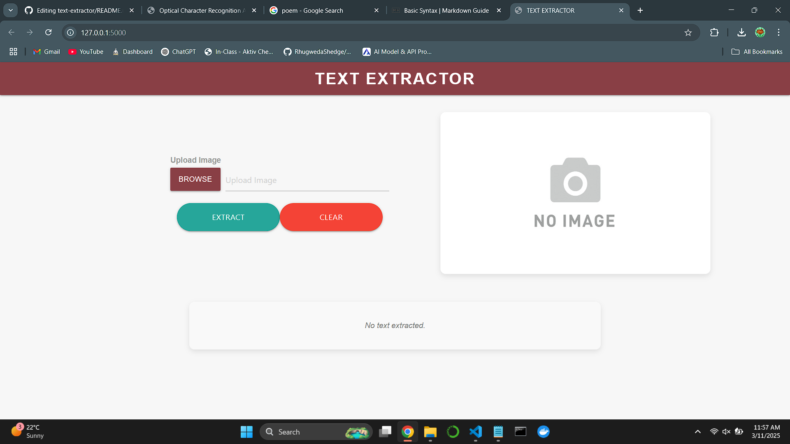
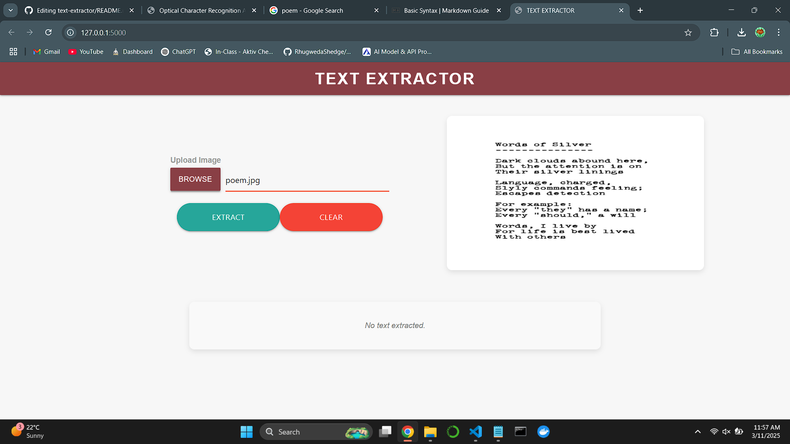
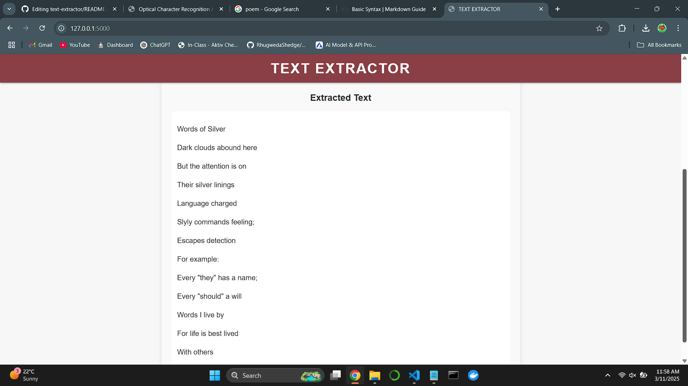

# 📌 Text Extractor 

A web application that extracts text from images using Optical Character Recognition (OCR) with Tesseract and OpenCV.

## 🚀 Overview
This web application allows users to upload an image, extract the text from the image using Optical Character Recognition (OCR), and display the text on the webpage. The app uses Flask for the backend, OpenCV for image processing, and Tesseract for OCR text extraction. The text is processed to remove unwanted symbols, making it cleaner and easier to read.

This project is useful for:
- Extracting text from images for documentation and note-taking.
- Converting scanned images or photographs with text into editable content.

### Target Audience:
- Developers who want to integrate OCR in their projects.
- Users who need to extract text from images quickly.

## HighLights

### Demo 2:

### Demo 3:

## 🛠 Features
- ✅ Upload image and perform text extraction.
- ✅ Convert image to grayscale for better OCR accuracy.
- ✅ Automatically remove unwanted symbols from extracted text.
- ✅ Display the extracted text on the webpage in a clean format.

## 🏗 Tech Stack
- **Programming Language:** Python
- **Framework:** Flask
- **Libraries:** OpenCV, PIL, pytesseract, numpy
- **Tools:** Docker, GitHub Actions

## Steps to run application locally:

Step 1: Create the copy of the project

Step 2: Open command prompt and change your current path to folder where you can find 'app.py' file

Step 3: Create environment by command given below
conda create -p <environment name>

Step 4: Activate environment by following command:
conda activate <environment name>

Step 5: Install everything of requirements.txt file using following command:
pip install -r requirements.txt

Step 6: Run application by command
python application.py
You will get url copy it and paste in browser.

Step 7: Click on the "Choose File" button to upload an image.

Step 8:The app will process the image, extract the text, and display it on the same page.

Step 9: You have sample_data folder where you can get images to text.

